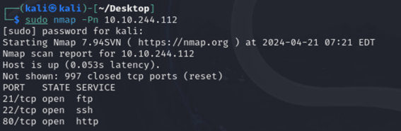
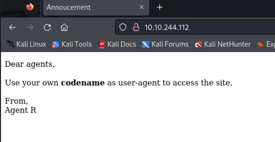

Lo primero que haremos será lanzar este nmap: sudo nmap -Pn 10.10.244.112

Luego si nos vamos a la pagina web de la ip veremos que es importante el tema de user-agent.

Pregunta: Como te redireccionas a una página secreta: user-agent
Cuál es el agent name?
Ahora inspeccionamos la pagina y refrescamos la página:

 
Y ahora le daremos a la segunda opción y luego a edit and resend y arriba ponemos ip/agent_C_attention.php

Respuestas Parte 2:

How many open ports: 3 (con nmap)
How you redirect yousrself to a secret page: user-agent
Y el nombre del agente es Chris
Ahora hacemos un ataque de fuerza bruta al ftp:
hydra -l chris -P /usr/share/wordlists/rockyou.txt 10.10.183.115 ftp
Y ya nos da el usuario y contraseña:
 

Ahora nos conectamos al ftp con esas credenciales y hacemos un mget * para coger todos los ficheros y llevarlos a nuestro equipo.

Ahora ejecutamos el siguiente comando para ver esta imagen y extraer algunos archivos:

Hacemos un cd al nuevo directorio: 

Y luego haremos estos comandos:
zip2john 8702.zip > hashzip.txt
cat hashzip.txt
john hashzip.txt 8702.zip

Y ahora descomprimimos el zip con la contraseña alien:

Ahora nos vamos a hacerle un cat al fichero que acabamos de extraer del zip:

Y nos vamos a ciberchef y nos da la contraseña que es Area51:
 

Ahora haremos este comando y metemos la contraseña area51:

Ahora hacemos un cat a message.txt y nos da un usuario y una contraseña:

Y entramos por ssh con estas credenciales:

Y ya tenemos la flag del usuario:

Ahora hacemos este comando:

Y abrimos un servidor en el ssh de Python para pasarnos la imagen:

Y esta es la imagen que extraemos:

Filtramos la imagen con Google Lens:
 

Si filtramos por Google y buscamos lo siguiente: 

Esta es la siguiente flag:

Hacemos un sudo -l y vemos lo siguiente:

Buscamos esto en Google:

 
El CVE es:

ESCALAR PRIVILEGIOS:
Hacemos esto: sudo -u#-1 /bin/bash

Y nos vamos a cd/root y hacemos un ls y un cat a root.txt

Y el Agent R es: DesKel 

