Lo primero que haremos será lanzar este nmap: sudo nmap -Pn 10.10.244.112

Luego si nos vamos a la pagina web de la ip veremos que es importante el tema de user-agent.

Pregunta: Como te redireccionas a una página secreta: user-agent
Cuál es el agent name?
Ahora inspeccionamos la pagina y refrescamos la página:

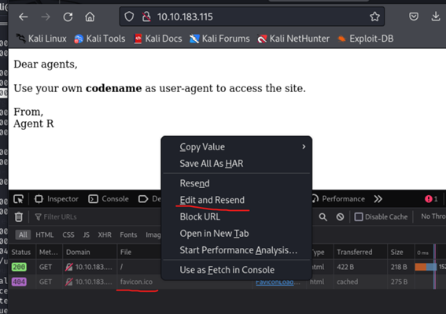
 
Y ahora le daremos a la segunda opción y luego a edit and resend y arriba ponemos ip/agent_C_attention.php

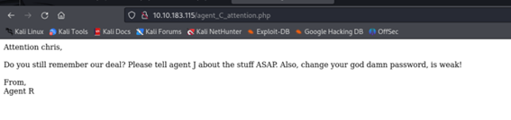

Respuestas Parte 2:

How many open ports: 3 (con nmap)
How you redirect yousrself to a secret page: user-agent
Y el nombre del agente es Chris
Ahora hacemos un ataque de fuerza bruta al ftp:
hydra -l chris -P /usr/share/wordlists/rockyou.txt 10.10.183.115 ftp
Y ya nos da el usuario y contraseña:
 
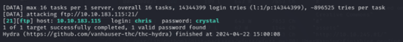

Ahora nos conectamos al ftp con esas credenciales y hacemos un mget * para coger todos los ficheros y llevarlos a nuestro equipo.

Ahora ejecutamos el siguiente comando para ver esta imagen y extraer algunos archivos:

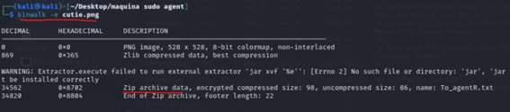

Hacemos un cd al nuevo directorio: 

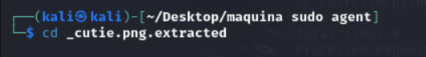

Y luego haremos estos comandos:
zip2john 8702.zip > hashzip.txt
cat hashzip.txt
john hashzip.txt 8702.zip

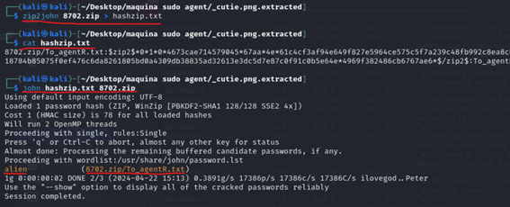

Y ahora descomprimimos el zip con la contraseña alien:

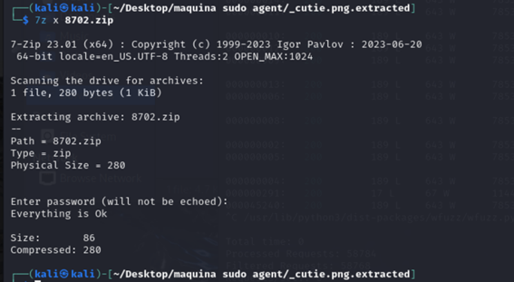

Ahora nos vamos a hacerle un cat al fichero que acabamos de extraer del zip:

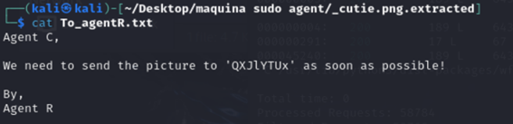

Y nos vamos a ciberchef y nos da la contraseña que es Area51:
 
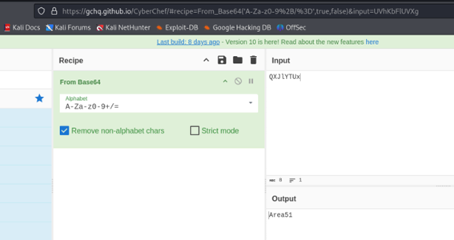

Ahora haremos este comando y metemos la contraseña area51:

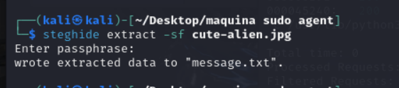

Ahora hacemos un cat a message.txt y nos da un usuario y una contraseña:

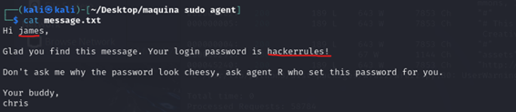

Y entramos por ssh con estas credenciales:

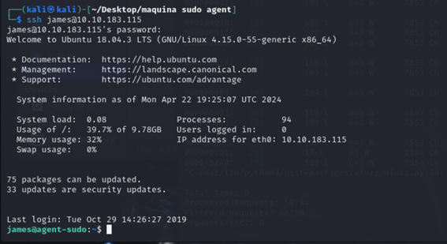

Y ya tenemos la flag del usuario:

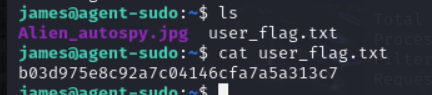

Ahora hacemos este comando:

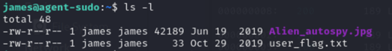

Y abrimos un servidor en el ssh de Python para pasarnos la imagen:

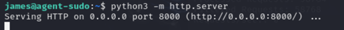

Y esta es la imagen que extraemos:

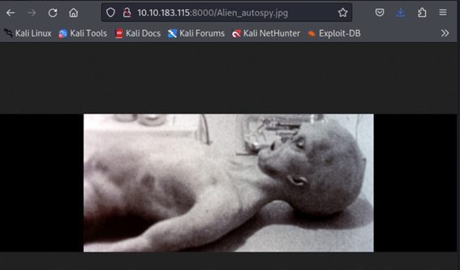

Filtramos la imagen con Google Lens:
 
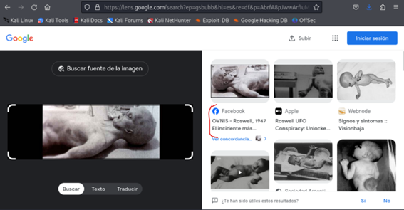

Si filtramos por Google y buscamos lo siguiente: 

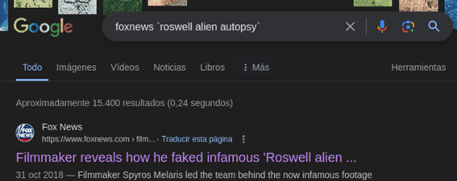

Esta es la siguiente flag:

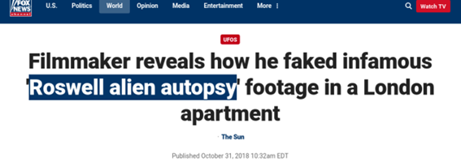

Hacemos un sudo -l y vemos lo siguiente:

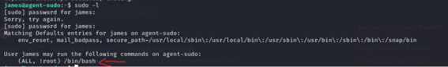

Buscamos esto en Google:

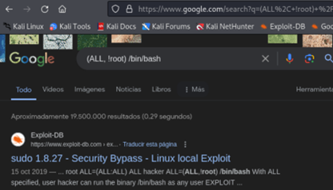
 
El CVE es:

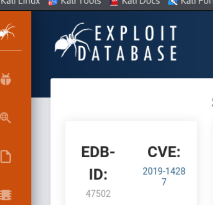

ESCALAR PRIVILEGIOS:
Hacemos esto: sudo -u#-1 /bin/bash

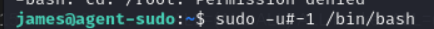

Y nos vamos a cd/root y hacemos un ls y un cat a root.txt

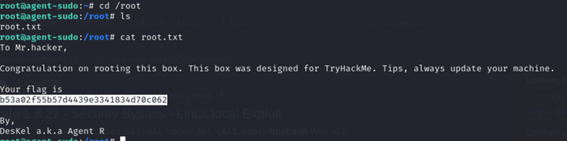

Y el Agent R es: DesKel 

