Lo primero que haremos será lanzar este nmap y escanearemos los puertos de la máquina: 
sudo nmap -A -T4 -p- 10.10.219.110 -vvv

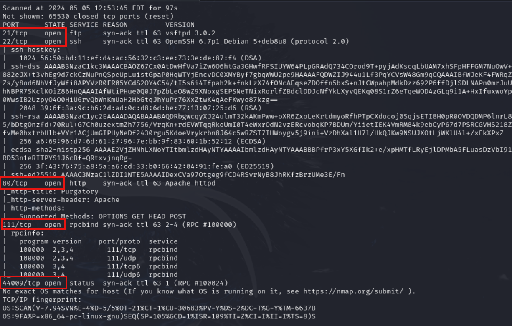

Ahora lanzaremos un gobuster con el siguiente comando:
gobuster dir -u http://10.10.219.110/ -w /usr/share/wordlists/dirbuster/directory-list-2.3-small.txt

Y sacamos este directorio que es importante /island.

Ahora nos metemos en el navegador y ponemos 10.10.219.110/island y entramos y veremos un mensaje como que el "Code Word" es: ? 

Si nos metemos en el código fuente de la página veremos que nos da una respuesta de que el "Code Word" es ******.

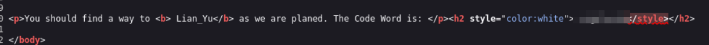

Ahora realizamos otro Gobuster a la URL que encontramos antes:

gobuster dir -u http://10.10.219.110/island -w /usr/share/wordlists/dirbuster/directory-list-2.3-small.txt

Y sacamos que hay un directorio importante que se llama /island/2100 si nos metemos dentro veremos que hay un video y que no podemos acceder a verlo.

Si nos metemos en el código fuente veremos la siguiente pista:

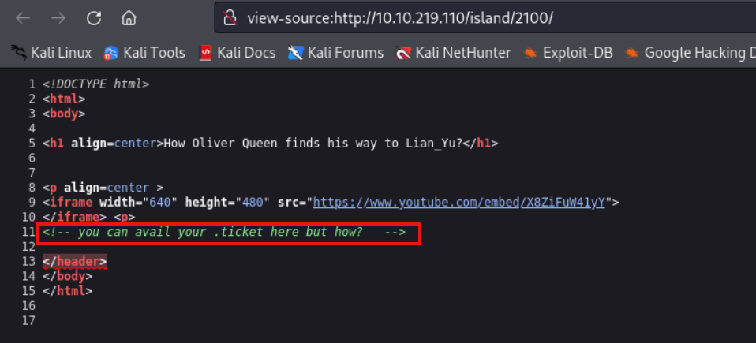

Ahora haremos un gobuster a la url anterior pero con la extensión .ticket para buscar los ficheros con esa extensión:

gobuster dir -x .ticket -u http://10.10.219.110/island/2100 -w /usr/share/wordlists/dirbuster/directory-list-2.3-small.txt

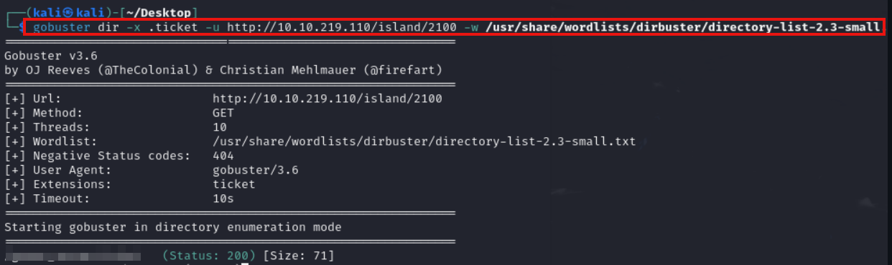

Una vez encontrado este directorio nos vamos a esa ruta y nos encontramos unas posibles credenciales:

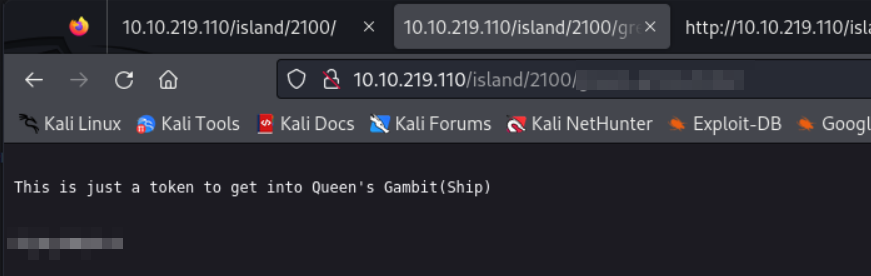

Vamos a intentar descifrarlo con cyberchef y vemos que estaba en base58, y el resultado que nos da es este:

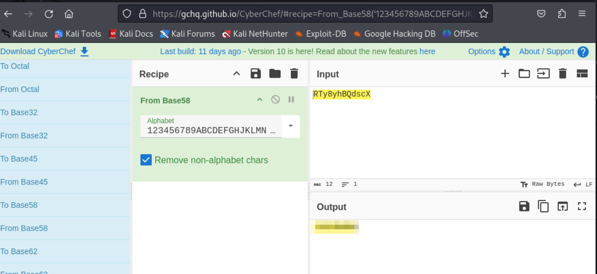

Ahora probamos con el usuario que teniamos antes que era vigilante y con esta contraseña y podremos entrar al ftp con:

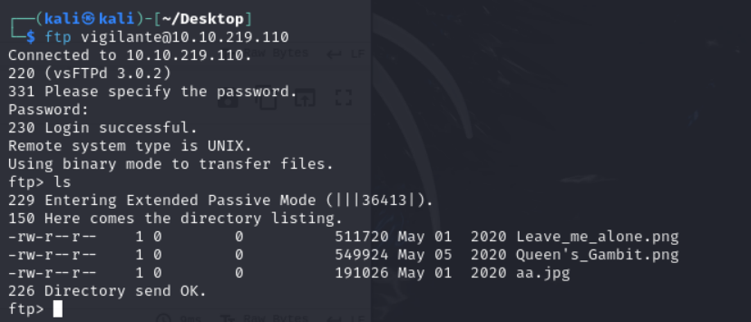

Ahora extraeremos a nuestro equipo esas 3 imagenes con el comando get nombre_del_archivo.extensión

Y luego probamos con el comando stegcracker aa.jpg y veremos que nos saca un archivo .zip 

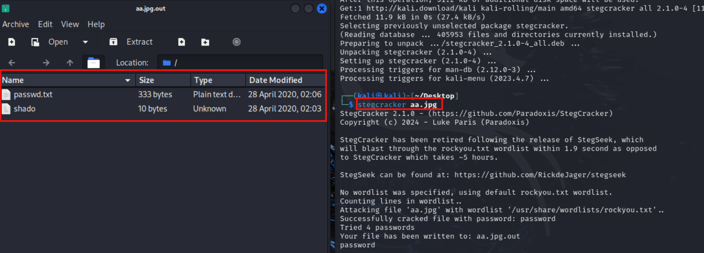

Dentro del zip hay dos archivos shado y passwd, uno con una posible contraseña y otro con un texto que no nos da ninguna pista.

Anteriormente en el ftp vimos 2 usuarios slade y vigilante:

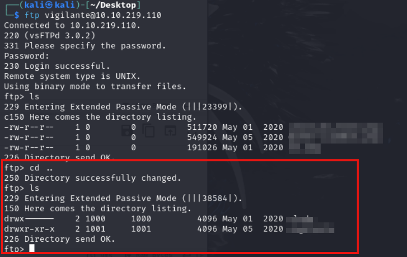

Ahora intentamos entrar a ssh con el usuario slade y con la contraseña que nos encontramos en el archivo sudo y podemos entrar.

Y vemos que podemos entrar sin problemas:

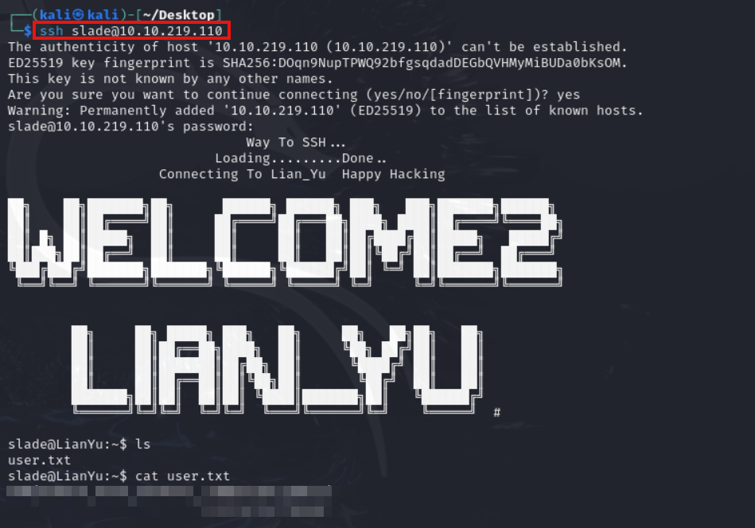

Ahora haremos un sudo -l y nos saldran unos comandos para ver qué comandos puede ejecutar como administrador el usuario en cuestión.

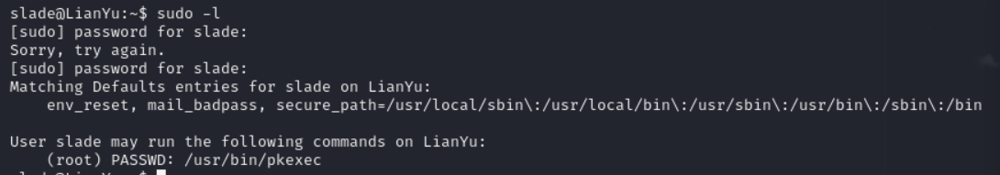

Ahora buscamos el comando pkexec en la página web gtfobins y nos saldrá como podemos ejecutar el siguiente comando para escalar privilegios:

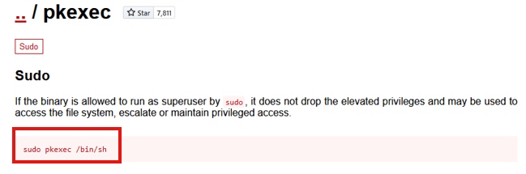

Y ya tendremos el acceso a root y dentro de root.txt tendremos la última flag.

