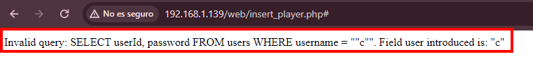
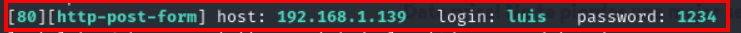
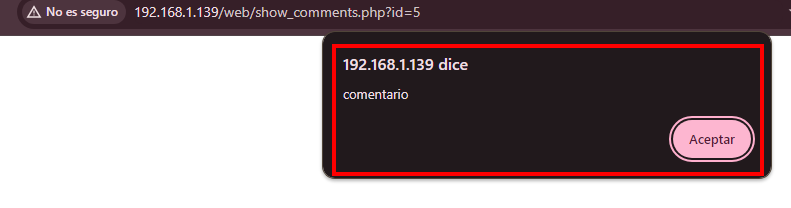

Trabajo realizado por:

- Álvaro Bueno Ortiz

## Índice

1. [Declaración de confidencialidad](#declaración-de-confidencialidad)
2. [Descargo de responsabilidad](#descargo-de-responsabilidad)
3. [Información de contacto](#información-de-contacto)
4. [Resumen ejecutivo](#resumen-ejecutivo)
5. [Calificación de severidad de hallazgos](#calificación-de-severidad-de-hallazgos)
6. [Factores de riesgo](#factores-de-riesgo)
7. [Resumen de vulnerabilidades y Reporte de evaluación](#resumen-de-vulnerabilidades-y-reporte-de-evaluación)

## Declaración de confidencialidad

Este documento es propiedad exclusiva de Álvaro Bueno Ortiz. Este documento contiene información propietaria y confidencial. La duplicación, redistribución o uso, total o parcial, en cualquier forma, requiere el consentimiento de Álvaro Bueno Ortiz, puede compartir este documento con auditores bajo acuerdos de no divulgación para demostrar el cumplimiento de los requisitos de las pruebas de penetración.

## Descargo de responsabilidad

Una prueba de penetración se considera una instantánea en el tiempo. Los hallazgos y recomendaciones reflejan la información recopilada durante la evaluación y no cualquier cambio o modificación realizado fuera de ese periodo. Los compromisos limitados en el tiempo no permiten una evaluación completa de todos los controles de seguridad.

Se priorizó la evaluación para identificar los controles de seguridad más débiles que un atacante aprovecharía. La organización recomienda realizar evaluaciones similares anualmente por evaluadores internos o de terceros para garantizar el éxito continuo de los controles.

## Información de contacto

| Nombre                | Cargo                  | Información de Contacto           |
| ------------------- | ---------------------- | ------------------------------------ |
| Álvaro Bueno        | Pentester     | Oficina: (111) 111-1111               |
|                     |                        | Email: abueort2109@g.educaand.es     |

## Resumen ejecutivo (Terminar)

La empresa de seguridad informática ¿Ciberseguros? G4. llevó a cabo varias pruebas de penetración sobre cinco máquinas de la empresa CyberSecPro S.A. Las pruebas se efectuaron entre los días 23/04/2024 y 25/04/2024. A raíz de ellas, se localizaron varias vulnerabilidades críticas y de alto riesgo en el entorno de ambas máquinas.

Estas vulnerabilidades podrían permitir a un atacante obtener acceso a nivel de sistema y comprometer la confidencialidad, integridad y disponibilidad de los datos del cliente. Además, se identificaron varias vulnerabilidades de alto impacto que podrían resultar en la pérdida de datos y/o tiempo de inactividad.

Se insta a CyberSecPro S.A. a tomar acciones correctivas inmediatas, incluyendo la aplicación de parches de seguridad, actualización de software obsoleto y mejorar las políticas de acceso y autenticación. Posteriormente, se recomienda realizar nuevas pruebas de penetración para asegurar que los sistemas han alcanzado un nivel adecuado de seguridad y robustez.

Se recomienda a CyberSecPro S.A. tomar medidas inmediatas para abordar estas vulnerabilidades, tales como implementar parches de seguridad, realizar actualizaciones de software, y fortalecer las políticas de acceso y autenticación. Una vez realizadas estas acciones, se recomienda volver a contactar con nosotros para realizar nuevamente pruebas de penetración y comprobar que el sistema ha alcanzado un estado de seguridad maduro y robusto.

## Calificación de severidad de hallazgos

| **Severidad** | **Rango de Puntuación CVSS V3** | **Definición**                                               |
| ------------- | :-----------------------------: | :----------------------------------------------------------- |
| Crítico       |            9.0-10.0             | La explotación es sencilla y generalmente resultan en un compromiso a nivel del sistema. Se recomienda elaborar un plan de acción y parchear inmediatamente. |
| Alto          |             7.0-8.9             | La explotación es más difícil, pero podría causar privilegios elevados y potencialmente la pérdida de datos o tiempo de inactividad. Se recomienda formar un plan de acción y parchear tan pronto como sea posible. |
| Moderado      |             4.0-6.9             | Existen vulnerabilidades, pero no son explotables o requieren pasos adicionales como la ingeniería social. Se recomienda formar un plan de acción y parchear después de que se hayan resuelto los problemas de alta prioridad. |
| Bajo          |             0.1-3.9             | Las vulnerabilidades no son explotables pero reducirían la superficie de ataque de una organización. Se recomienda formar un plan de acción y parchear durante la próxima ventana de mantenimiento. |
| Informativo   |               N/A               | No existe vulnerabilidad. Se proporciona información adicional sobre los elementos observados durante la prueba, los controles sólidos y la documentación adicional. |

## Factores de riesgo

El riesgo se mide por dos factores: Probabilidad e Impacto:

### Probabilidad 

La probabilidad mide el potencial de explotación de una vulnerabilidad. Las calificaciones se basan en la dificultad del ataque, las herramientas disponibles, el nivel de habilidad del atacante y el entorno del cliente.

### Impacto 

El impacto mide el efecto potencial de la vulnerabilidad en las operaciones, incluida la confidencialidad, integridad y disponibilidad de los sistemas y/o datos del cliente, el daño reputacional y la pérdida financiera.

# Vulnerabilidad 1: SQL Injection

|   3      |       |           |      |              |
| -------- | ----- | --------- | ---- | ------------ |
| Críticas | Altas | Moderadas | Bajas | Informativas |

| Descripción del descubrimiento | ** La neutralización inadecuada de elementos especiales permite una vulnerabilidad de inyección SQL **                                                |
| ------------------------------ | ------------------------------------------------------------ |
| CVE/CWE                        | [CVE-2023-3047](https://nvd.nist.gov/vuln/detail/CVE-2023-3047) |
| CVSS v3                        | [9.8](https://nvd.nist.gov/vuln/detail/CVE-2023-3047) |
| Severidad                      | Crítica  |
| Impacto                        | Acceso no autorizado a datos personales o sensibles y modificación no autorizada de datos.  |
| Sistemas Afectados             | Página web en la ruta: web/insert_player.php                                         |
| Pruebas de concepto            | 
| Remediación                    | Validar y sanear todas las entradas posibles de los campos y tablas, usar consultas preparadas y parámetros enlazados. |
| Referencias                    | [Remediación](https://pressroom.hostalia.com/white-papers/ataques-inyeccion-sql/) |

# Vulnerabilidad 2: Ataque de fuerza bruta

### Descubrimiento 2 - Plaintext Storage of a Password

| Descripción del descubrimiento |   **Los atacantes pueden acceder fácilmente a la cuenta vulnerable utilizando diferentes contraseñas durante la autenticación múltiple.**                                  |
| ------------------------------ | ------------------------------------------------------------ |
| CVE/CWE                        | [CWE-307](https://cwe.mitre.org/data/definitions/307.html) |
| CVSS v3                        | [9.4](https://nvd.nist.gov/vuln-metrics/cvss/v3-calculator?vector=AV:N/AC:L/PR:N/UI:N/S:U/C:H/I:H/A:L&version=3.1) |
| Severidad                      | Alta  |
| Impacto                        | Es posible que los datos cruciales se corrompan o modifiquen de manera inadecuada |
| Sistemas Afectados             | Sistemas que no utilizan medidas contra la autenticación no confiable                                 |
| Pruebas de concepto            |  |
| Remediación                    | Implementación de controles de flujo más robustos, la validación adecuada de las entradas de los usuarios |
| Referencias                    | [Remediación](https://community.bonitasoft.com/questions-and-answers/how-fix-vulnerability-cwe%E2%80%93307-improper-restriction-excessive-authentication) |

# Vulnerabilidad 3: XSS Cross-Site Scripting

| Descripción del descubrimiento |   ** Pueden aprovechar esta vulnerabilidad para instalar complementos arbitrarios, que permiten la ejecución remota de código**                                  |
| ------------------------------ | ------------------------------------------------------------ |
| CVE/CWE                        | [CVE-2019-11580](https://www.incibe.es/incibe-cert/alerta-temprana/vulnerabilidades/CVE-2019-11580) |
| CVSS v3                        | [9.8](https://www.incibe.es/incibe-cert/alerta-temprana/vulnerabilidades/CVE-2019-11580) |
| Severidad                      | Crítica  |
| Impacto                        | Un atacante podría aprovechar esta vulnerabilidad para inyectar y ejecutar código JavaScript malicioso en el contexto del navegador de un usuario que interactúa con la aplicación afectada. |
| Sistemas Afectados             | /web/list_players.php                                  |
| Pruebas de concepto            |  |
| Remediación                    | Intentar minimizar el uso de entradas no confiables |
| Referencias                    | [Remediación](https://nvd.nist.gov/vuln/detail/cve-2019-11580) |

# Vulnerabilidad 4:

| Descripción del descubrimiento |   **Almacenamiento de contraseñas en texto plano**                                  |
| ------------------------------ | ------------------------------------------------------------ |
| CVE/CWE                        | [CWE-256](https://cwe.mitre.org/data/definitions/256.html) |
| CVSS v3                        | [7.7](https://nvd.nist.gov/vuln-metrics/cvss/v3-calculator) |
| Severidad                      | Alta  |
| Impacto                        | Compromiso de la integridad y confidencialidad de múltiples usuarios. Lo que conlleva múltiples vías de entrada al sistema. |
| Sistemas Afectados             | 10.10.10.5                                  |
| Pruebas de concepto            |  |
| Remediación                    | Utilizar algoritmos de hashing seguros y diseñados especificamente para las contraseñas, aplicar sal a las contraseñas antes de su almacenamiento, almacenar los hashes y sales de manera segura, asegurar la base de datos contra accesos no autorizados implementando medidas como el cifrado y autenticación segura. |
| Referencias                    | [Remediación](https://www.security-database.com/cwe.php?name=CWE-256) |
